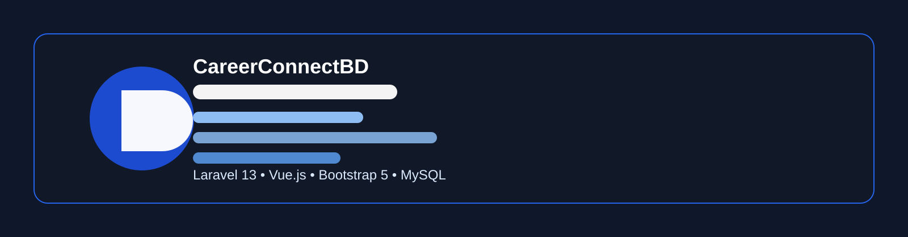
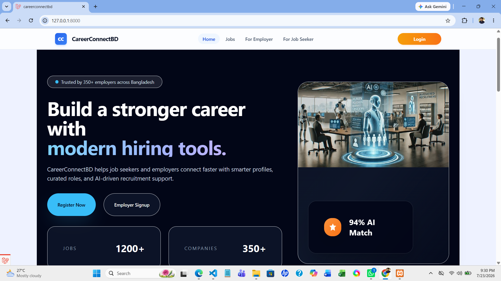
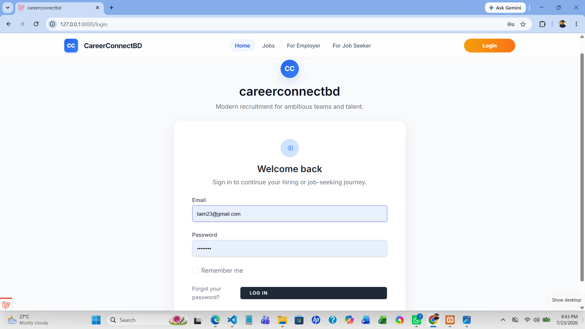
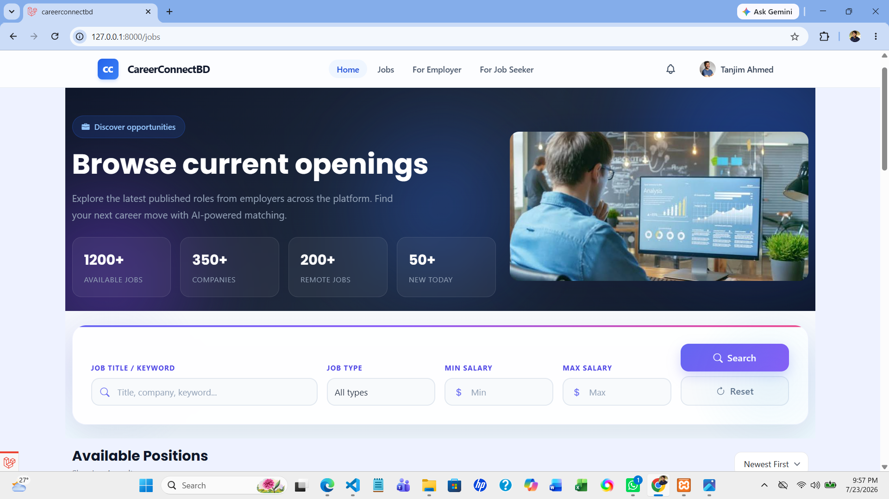
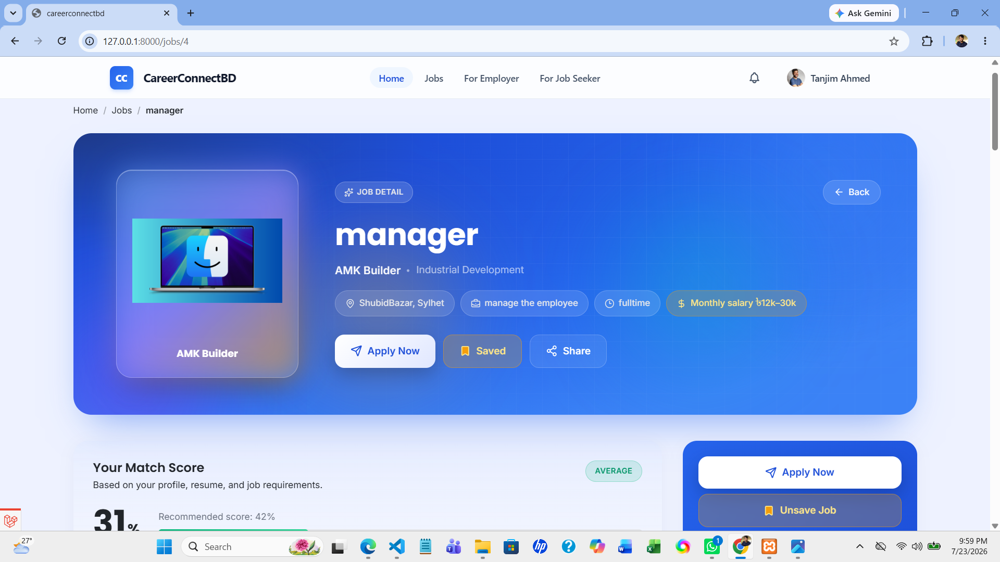
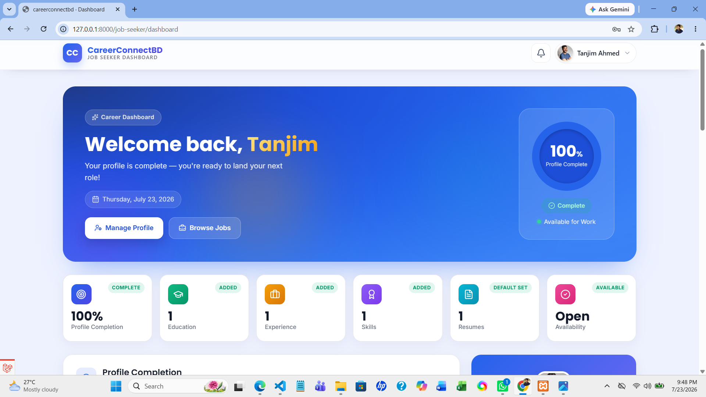
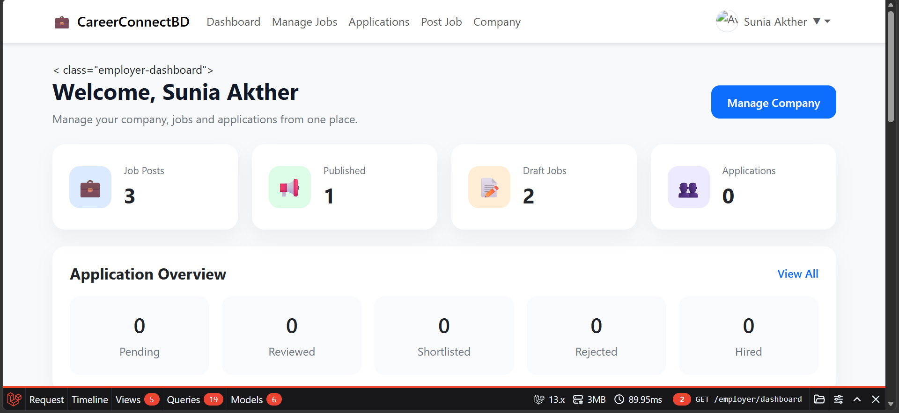
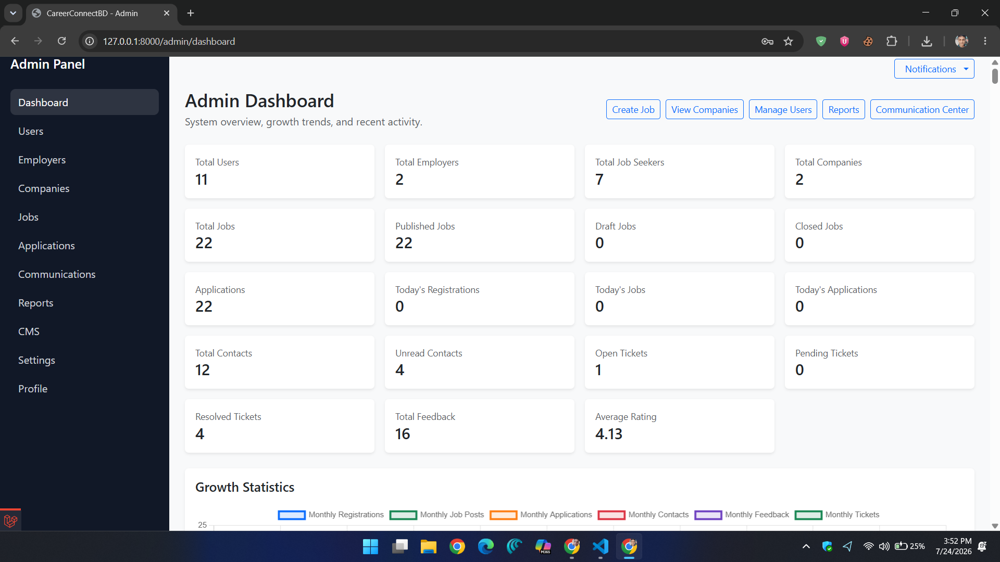
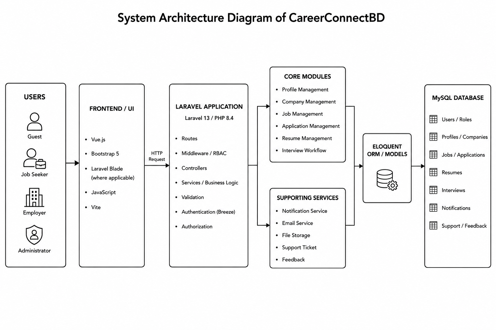

# CareerConnectBD

> Quick links: [Overview](#project-overview) • [Highlights](#project-highlights) • [Diagrams](#system-diagrams) • [Docs](#documentation-hub)

<p align="center">
  
</p>

<h1 align="center">CareerConnectBD</h1>

<p align="center">
  <strong>A Modern Web-Based Career & Recruitment Management Platform built with Laravel 13, Vue.js, Bootstrap 5, and MySQL.</strong>
</p>

<p align="center">
  <a href="https://github.com/mdtareqmiah/CareerConnectBD1"></a>
  <a href="https://github.com/mdtareqmiah/CareerConnectBD1"></a>
  <a href="https://github.com/mdtareqmiah/CareerConnectBD1"></a>
  <a href="https://github.com/mdtareqmiah/CareerConnectBD1"></a>
  <a href="https://github.com/mdtareqmiah/CareerConnectBD1"></a>
  <a href="https://github.com/mdtareqmiah/CareerConnectBD1"></a>
  <a href="https://github.com/mdtareqmiah/CareerConnectBD1/stargazers"></a>
  <a href="https://github.com/mdtareqmiah/CareerConnectBD1/forks"></a>
  <a href="https://github.com/mdtareqmiah/CareerConnectBD1/issues"></a>
</p>

## 🌐 Live Demo

Local demo instructions are included in the installation section below.

## 📚 Table of Contents

- [Project Overview](#project-overview)
- [Project Highlights](#project-highlights)
- [Feature Matrix](#feature-matrix)
- [Project Statistics](#project-statistics)
- [Quick Start](#-quick-start)
- [Repository Structure](#-repository-structure)
- [Screenshot Gallery](#screenshot-gallery)
- [Architecture & Design](#architecture--design)
- [System Diagrams](#system-diagrams)
- [Documentation Hub](#documentation-hub)
- [Project Team](#project-team)
- [Requirements](#requirements)
- [Installation](#installation)
- [Support](#support)

## ⚡ Quick Start

```bash
git clone https://github.com/mdtareqmiah/CareerConnectBD1.git
cd careerconnect-bd
composer install
npm install
cp .env.example .env
php artisan key:generate
php artisan migrate --seed
npm run dev
php artisan serve
```

## 📁 Repository Structure

```text
app/
bootstrap/
config/
database/
docs/
public/
resources/
routes/
storage/
tests/
```

## 🌐 Project Overview

CareerConnectBD is a Laravel-based hiring platform designed to support a complete recruitment workflow across multiple roles. The project combines public-facing job discovery, role-aware dashboards, profile and resume-related workflows, employer-side job management, and administrative oversight in a single experience.

## ✨ Project Highlights

| Technology / Feature | Status |
| --- | --- |
| Laravel 13 | Implemented |
| Vue.js | Implemented |
| Bootstrap 5 | Implemented |
| MySQL | Implemented |
| RBAC | Implemented |
| Resume Builder | Implemented |
| Recruitment Workflow | Implemented |
| Notification System | Implemented |
| PHPUnit Testing | Implemented |

## 📊 Project Statistics

- 7 architecture diagrams are available in [docs/architecture/Diagrams](docs/architecture/Diagrams)
- 17 project and milestone reports are available in [docs/reports](docs/reports)
- 29 screenshot assets are available in [docs/Screenshots](docs/Screenshots)
- The repository includes Laravel, Blade, Vite, Bootstrap, MySQL, and PHPUnit-based application structure as documented in [composer.json](composer.json) and [package.json](package.json)

## 🧩 Feature Matrix

| Feature | Guest | Job Seeker | Employer | Administrator |
| --- | --- | --- | --- | --- |
| Browse Jobs | ✓ | ✓ | ✓ | ✓ |
| Register | ✓ | ✓ | ✓ | ✓ |
| Login | ✓ | ✓ | ✓ | ✓ |
| Resume Builder |  | ✓ |  |  |
| Apply Jobs |  | ✓ |  |  |
| Manage Jobs |  |  | ✓ | ✓ |
| View Applicants |  |  | ✓ | ✓ |
| Manage Users |  |  |  | ✓ |
| Notifications | ✓ | ✓ | ✓ | ✓ |
| Support Tickets | ✓ | ✓ | ✓ | ✓ |
| Feedback | ✓ | ✓ | ✓ | ✓ |

## 📸 Screenshot Gallery

A curated set of representative screenshots highlights the platform’s main flows and experiences.

### 🌐 Landing Page


A polished landing experience for introducing the platform to new visitors.

### 🔐 Login Page


A secure sign-in experience for returning users.

### 💼 Job Listing


A structured job listing experience for candidates.

### 🧾 Job Details


A clear, detail-focused view of a hiring opportunity.

### 👤 Job Seeker Dashboard


A role-aware dashboard for managing profile and application activity.

### 🏢 Employer Dashboard


An employer workspace for managing hiring operations.

### 🛡️ Admin Dashboard


An administrative view for overseeing platform activity.

## 🏗️ Architecture & Design

<p align="center">
  
</p>

CareerConnectBD follows a Laravel-based application structure with role-aware routes, controller-driven workflows, Blade-based views, and Eloquent models for the core hiring and administration experience.

## 🔗 System Diagrams

- [ER Diagram](docs/architecture/Diagrams/ERDiagram.png) — Represents the main entities and relationships that support users, profiles, jobs, applications, and administrative data.
- [Use Case Diagram](docs/architecture/Diagrams/UseCaseDiagram.png) — Illustrates the major interactions between guests, job seekers, employers, and administrators.
- [Activity Diagram](docs/architecture/Diagrams/Activity%20Diagram.png) — Captures the flow of actions in key platform workflows.
- [DFD Level 0](docs/architecture/Diagrams/DFD%20Level%2000.png) — Shows the high-level data flow between the system and its external actors.
- [DFD Level 1](docs/architecture/Diagrams/DFD%20Level%201.png) — Breaks the primary processes into more detailed data-flow steps.
- [Component-Level Design](docs/architecture/Diagrams/Component-LevelDesignDiagram.png) — Maps the major software components and their responsibilities.
- [System Architecture](docs/architecture/Diagrams/SystemArchitectureDiagram.png) — Provides an overview of the platform’s layered application structure.

## 📚 Documentation Hub

The repository includes structured documentation and visual references that support both product understanding and implementation review:

- [Architecture Notes](docs/architecture/authorization.md) — Core design notes for authorization and access control.
- [Job Seeker Module Architecture](docs/architecture/job-seeker-module.md) — Notes describing the job-seeker profile and related workflow design.
- [Architecture Diagrams](docs/architecture/Diagrams) — Visual system documentation for the platform’s design artifacts.
- [Project Reports](docs/reports) — Milestone and implementation reports covering feature delivery and fixes.
- [Project Report](docs/Milestone-4-Report.md) — A consolidated overview of completed project work.
- [Project Review Report](docs/reports/project-review-report.md) — A review summary of stabilization and verification outcomes.
- [Project Report PDF](docs/SIU_CSE_400_Project_ReportM.pdf) — The full project report document.
- [Screenshots](docs/Screenshots) — Visual evidence of the platform’s main user experiences.

## 👥 Project Team

The repository documentation reflects a collaborative implementation effort centered on the following contributors:

| Member | Contribution |
| --- | --- |
| Md. Tareq Miah | Backend development with Laravel 13 and PHP, MySQL schema and Eloquent-based data modeling, authentication and RBAC implementation, job seeker and employer workflows, recruitment and notification modules, testing, debugging, and documentation coordination |
| Asif Mahmud Khan | Vue.js frontend development, Bootstrap 5 responsive UI implementation, employer-related and recruitment-related interfaces, frontend-backend integration, and UI testing/debugging |
| Sunia Akther | Vue.js frontend development, job seeker interfaces and general user-facing UI work, responsive UI/UX implementation, form and interface validation support, UI testing/debugging, and documentation support |

## 🎯 Why Recruiters Should Review This Project

CareerConnectBD demonstrates a strong foundation for modern hiring-platform development with verified strengths in:

- Laravel MVC architecture and modular controller-based application structure
- Role-based access control and authentication workflows
- Database-backed profile, job, application, and administration flows
- Resume management and recruitment-oriented user experiences
- Automated testing and structured documentation
- Clear separation between guest, seeker, employer, and administrator experiences

## 🧰 Requirements

- PHP 8.3 or newer
- Composer
- Node.js and npm
- MySQL

## ⚙️ Installation

```bash
git clone https://github.com/mdtareqmiah/CareerConnectBD1.git
cd careerconnect-bd
composer install
npm install
cp .env.example .env
php artisan key:generate
```

Configure the local database connection in `.env` before continuing.

```bash
php artisan migrate
php artisan db:seed
php artisan storage:link
```

Run the application locally with:

```bash
npm run dev
php artisan serve
```

Verify the setup with:

```bash
php artisan test
npm run build
```

## 💬 Support

For questions, feedback, or repository support, please use the project issues tracker or contact the maintainers directly.

---

Support the Project by starring the repository and sharing it with others.

Made with ❤️ by the project team.

This project reflects a thoughtful approach to modern hiring-platform development and continues to evolve as a mature open-source initiative.
